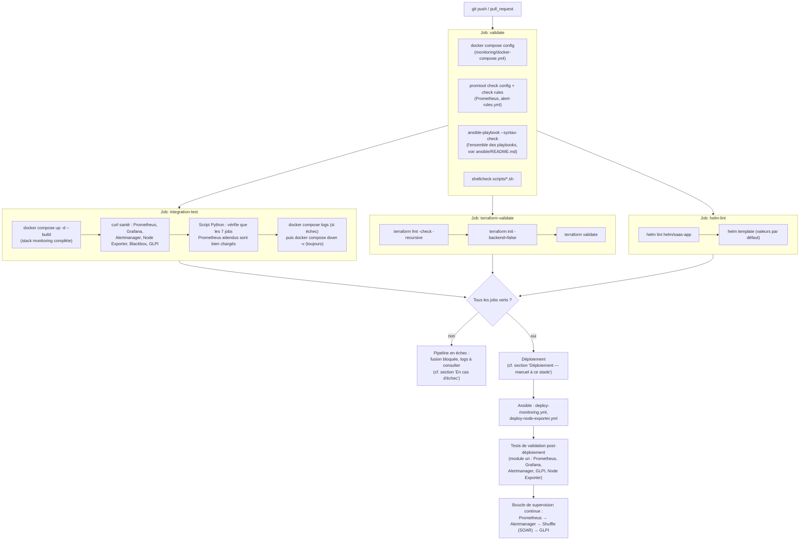

# Pipeline CI/CD — CYNA DevOps

Ce document détaille le pipeline CI/CD défini dans `.github/workflows/ci.yml`
et répond à l'exigence du sujet CYNA (« Livrables - Architecture Cloud
Hybride et Sécurité ») : *« Diagramme de flux montrant les pipelines CI/CD
pour automatiser le déploiement continu et les tests »*.

GitHub Actions est l'outil retenu (au lieu de Jenkins/GitLab CI cités en
exemple dans le sujet), cohérent avec le choix de GitHub comme plateforme de
versionnement pour l'ensemble du projet (cf. `docs/architecture-devops.md`).

## Déclencheurs

Le pipeline se déclenche sur chaque `push` et chaque `pull_request`, quelle
que soit la branche — pas de filtre sur `main` uniquement, pour valider une
branche de fonctionnalité avant fusion plutôt qu'après.

## Vue d'ensemble



## Détail des jobs

### `validate`

Validation statique uniquement (aucun service démarré) : configuration
Docker Compose, configuration et règles Prometheus (via `promtool` dans un
conteneur `prom/prometheus`), syntaxe des playbooks Ansible, et analyse
statique des scripts shell (`shellcheck`).

### `integration-test` (dépend de `validate`)

Contrairement à `validate`, ce job déploie réellement la stack de
supervision (`docker compose up -d --build`) sur le runner GitHub Actions et
vérifie que chaque service répond effectivement (`curl --fail` sur les
endpoints de santé), plutôt que de se contenter d'un contrôle de syntaxe qui
ne détecterait pas un service démarrant puis crashant immédiatement. Un
script Python interroge l'API Prometheus (`/api/v1/targets`) pour confirmer
que les 7 jobs de scrape attendus sont bien chargés. Les cibles de l'infra
Genève (VM GNS3) restent « down » en CI puisque non joignables depuis le
runner — c'est attendu, seul le chargement de la configuration est vérifié
à ce niveau.

### `terraform-validate`

Validation statique du module `terraform/` (`fmt`, `init -backend=false`,
`validate`) via `hashicorp/setup-terraform`. Pas de `terraform plan`/`apply`
en CI : aucun identifiant Azure (`ARM_*`) n'est configuré en secret du
dépôt à ce stade du projet (cf. `terraform/README.md`).

### `helm-lint`

Lint (`helm lint`) et rendu (`helm template`) du chart `helm/saas-app` via
`azure/setup-helm`. Pas de déploiement réel sur un cluster k3s en CI, pour
la même raison que Terraform (pas d'identifiants/kubeconfig en secret du
dépôt).

## Déploiement — manuel à ce stade

Le pipeline se limite aujourd'hui à la **validation** (statique et par test
d'intégration) : il n'existe pas de job `deploy` automatique déclenché sur
`main`, faute d'accès réseau direct entre les runners GitHub Actions
(hébergés hors du réseau CYNA) et les VM de la maquette Genève, et faute
d'identifiants stockés en secrets pour Ansible/Terraform/Helm. Le
déploiement reste donc une étape manuelle, déclenchée depuis la VM DevOps
elle-même :

```bash
ansible-playbook -i ansible/inventory.ini ansible/playbooks/deploy-monitoring.yml
ansible-playbook -i ansible/inventory.ini ansible/playbooks/deploy-node-exporter.yml
helm upgrade --install saas-app helm/saas-app -n saas --create-namespace -f helm/saas-app/values.yaml
```

Chacune de ces commandes inclut désormais ses propres tests de validation
post-déploiement (module Ansible `uri`, `helm lint`/`helm template` en
amont) — voir `docs/procedure-supervision.md` et `helm/saas-app/README.md`.
Un déploiement continu réel (self-hosted runner dans le réseau CYNA, ou
accès VPN site-à-site vers le hub Azure — cf. `terraform/README.md`, section
« Activer le VPN site-à-site ») est documenté ici comme évolution possible,
pas comme fonctionnalité déjà démontrée.

## En cas d'échec

- Le job `integration-test` archive les logs des conteneurs
  (`docker compose logs --tail=100`) avant de nettoyer, visibles dans
  l'onglet *Actions* de GitHub en cas d'échec.
- Un job en échec sur une Pull Request bloque visuellement la fusion (statut
  de check GitHub), sans règle de protection de branche obligatoire
  configurée à ce stade — point d'amélioration possible côté paramétrage du
  dépôt GitHub plutôt que du pipeline lui-même.
